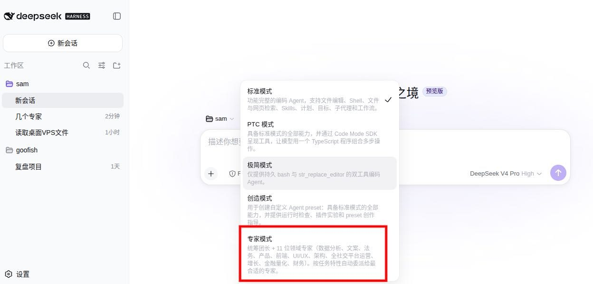
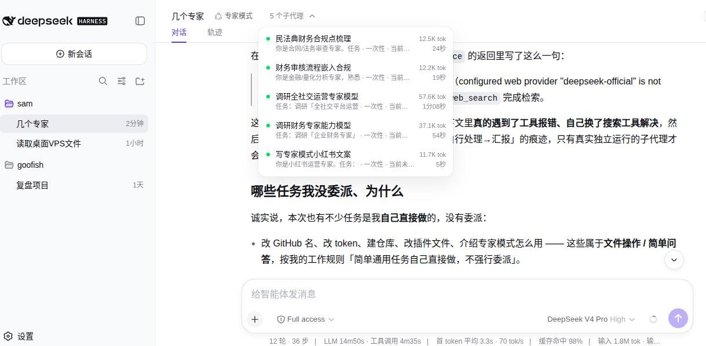

# 🧠 DSH 专家模式

<p align="center">
  <strong>首席协调官 + 16 位领域专家 — 全栈多智能体团队</strong><br/>
  <em>1 Coordinator + 16 Experts — Full-Stack Multi-Agent Team</em>
</p>

<p align="center">
  <a href="https://github.com/topics/dsh-plugin"></a>
  <a href="https://github.com/awesome-dsh-plugin/awesome-dsh-plugin"></a>
  <a href="https://github.com/Asher-2000/dsh-expert-mode/releases"></a>
  <a href="LICENSE"></a>
  <a href="https://github.com/Asher-2000/dsh-expert-mode"></a>
</p>

<p align="center">
  <a href="README.md">English</a> · <a href="README.zh.md">中文</a>
</p>

---

## ✨ 功能介绍

安装此预设后，DSH 自动变成「首席协调官」模式：

| 场景 | 行为 |
|------|------|
| 收到任务 | 识别领域 → 委派给最合适的专家 |
| 复杂任务 | 并行派发多个专家 |
| 简单任务 | 协调官直接处理 — 不强制委派 |
| 任务完成 | 专家在线等待后续修改 |

无需自定义提示词。无需多配置维护。**安装即用。**

---

## 🖼️ 演示

<p align="center">
  <br/>
  <em>在 DSH 工作区选择「专家模式」预设即可使用</em>
</p>

<p align="center">
  <br/>
  <em>5 个专家子代理并行工作，实时显示 token 用量和耗时</em>
</p>

---

## 🧩 16 位专家

### 🎯 全栈核心（6位）

| 专家 | 工具 | 领域 |
|------|------|------|
| 🖥️ 前端开发 | `expert_frontend_dev` | Web 前端、React/Vue、CSS/UI |
| 🖥️ 后端开发 | `expert_backend_dev` | API、服务器逻辑、认证授权 |
| 🗄️ 数据库 | `expert_database` | Schema 设计、SQL、优化 |
| 🏗️ 架构师 | `expert_architect` | 系统设计、技术选型 |
| 🛠️ DevOps | `expert_devops` | CI/CD、Docker、K8s、部署 |
| 🧪 测试工程师 | `expert_qa_engineer` | 测试策略、自动化 |

### 🔒 安全与数据（3位）

| 专家 | 工具 | 领域 |
|------|------|------|
| 🔒 安全专家 | `expert_security` | 代码审计、漏洞评估、加固 |
| 📊 数据分析师 | `expert_data_analyst` | 统计、可视化、洞察 |
| 🎨 UI/UX 设计 | `expert_uiux_design` | 界面设计、设计系统 |

### 💼 业务支持（7位）

| 专家 | 工具 | 领域 |
|------|------|------|
| 📋 产品经理 | `expert_product_manager` | PRD、需求分析、竞品调研 |
| ✍️ 文案专家 | `expert_copywriter` | 营销文案、内容创作 |
| ⚖️ 法务审核 | `expert_legal_review` | 合同审核、法律风险 |
| 📱 社交运营 | `expert_social_media` | 多平台分发、账号管理 |
| 🚀 增长黑客 | `expert_growth` | 增长策略、A/B 测试 |
| 💹 量化金融 | `expert_quant_finance` | 量化模型、风险控制 |
| 💰 财务专家 | `expert_finance` | 财务分析、预算规划 |

---

## 🛡️ 核心功能

| 功能 | 说明 |
|------|------|
| 🎯 **智能委派** | 自动识别任务领域，路由给最合适的专家 |
| 🚀 **快速通道** | 简单任务直接处理 — 不强制委派 |
| 🔄 **五锚约束** | 每轮自检，防止跑题和低效循环 |
| 🤝 **交叉评审** | 高风险任务多专家独立评审 |
| 💾 **经验沉淀** | 教训自动保存，下次注入 |
| 💬 **子代理通信** | 专家间可通过 send_message 通信（continuable 模式） |
| ⚡ **故障恢复** | 超时自动重试，连续失败换方案 |
| 📉 **渐进式披露** | 方法论按需注入，token 减少 28% |
| 🌐 **中英双语** | 完整中英文文档 |

---

## 📦 安装

```bash
# 在 DSH 工作区中执行
dsh plugin add @deepseek-ai/dsh-expert-mode
```

然后在工作区预设选择器中选择 **「专家模式」**。

---

## 🚀 快速开始

1. 安装插件
2. 选择「专家模式」预设
3. 提出任何问题 — 协调官自动委派给合适的专家

### 示例

```
用户：帮我设计一个用户认证系统

协调官：
  → 识别领域：后端开发 + 安全
  → 委派后端开发：API 设计、JWT 实现
  → 委派安全专家：安全审计、漏洞防护
  → 汇总输出完整方案
```

---

## 🏗️ 架构

```
┌─────────────────────────────────────────────────────────────────┐
│                    专家模式架构                                   │
├─────────────────────────────────────────────────────────────────┤
│                                                                  │
│  ┌──────────────────────────────────────────────────────────┐   │
│  │              首席协调官 (Coordinator)                      │   │
│  │  • 任务分析      • 领域识别                                │   │
│  │  • 专家路由      • 结果汇总                                │   │
│  └──────────────────────────────────────────────────────────┘   │
│                           │                                      │
│           ┌───────────────┼───────────────┐                     │
│           ▼               ▼               ▼                     │
│  ┌─────────────┐  ┌─────────────┐  ┌─────────────┐            │
│  │  前端开发   │  │  后端开发   │  │  DevOps     │            │
│  │  数据库     │  │  安全专家   │  │  测试       │            │
│  │  架构师     │  │  ...        │  │  ...        │            │
│  └─────────────┘  └─────────────┘  └─────────────┘            │
│                                                                  │
└─────────────────────────────────────────────────────────────────┘
```

---

## 📚 文档

| 文档 | 说明 |
|------|------|
| [用户指南](docs/user-guide.md) | 安装和使用方法 |
| [专家方法论](.expert-mode/experts/) | 每位专家的详细方法论 |
| [架构说明](docs/architecture.md) | 系统设计细节 |
| [更新日志](CHANGELOG.md) | 版本历史 |

---

## 🤝 贡献

1. Fork 仓库
2. 创建特性分支
3. 提交更改
4. 推送到分支
5. 创建 Pull Request

---

## 📄 许可证

MIT 许可证 - 详见 [LICENSE](LICENSE)。

---

## 🙏 致谢

- [DeepSeek Harness](https://github.com/deepseek-ai/deepseek-harness) - 核心框架
- [Cordis](https://github.com/cordiverse/cordis) - 插件系统
- [Awesome DSH Plugin](https://github.com/awesome-dsh-plugin/awesome-dsh-plugin) - 社区收录

